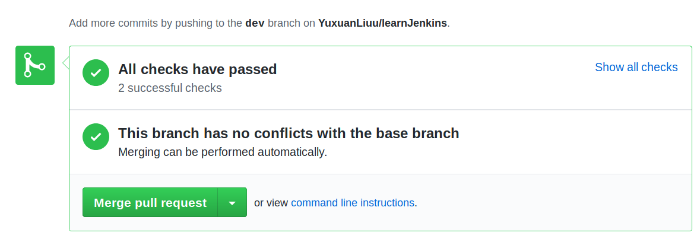
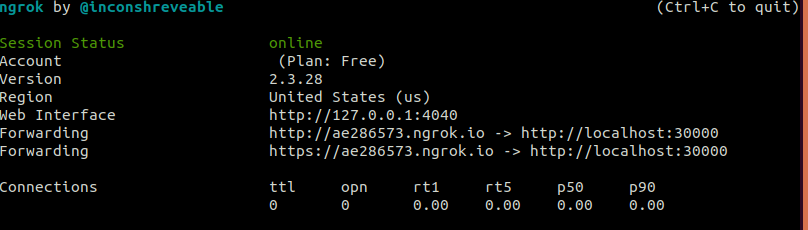
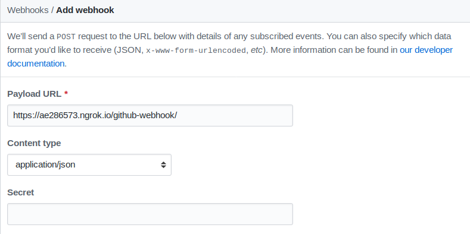

# Milestone 2: CI

## Intro

In this section, we build and test the project finished in homework 3 through continuous integration (CI) using **Jenkins** integrated with github.

## Tools
Jenkins, github

## Characteristic
1. Use Jenkins blueOcean pipeline and Jenkinsfile.
1. Every push to the github will trigger a Jenkins event.
2. Every pull request in github will trigger a Jenkins event.
3. Jenkins will notify github if one pull request passes CI build and test or not. Here is an example where a pull request passed CI.


## Prerequisite(docker)
We use the following cml to setup Jenkins with blueOcean in docker container.
```
docker run \
  --rm \
  -u root \
  -p 30000:8080 \
  -v jenkins-data:/var/jenkins_home \
  -v /var/run/docker.sock:/var/run/docker.sock \
  -v "$HOME":/home \
  jenkinsci/blueocean
```

## Configuration
We configured both github and Jenkins blueOcean.
### Config Jenkins blueOcean.
There is basically no explicit configuration using the new jenkins UI blueOcean. We follow the steps described [in this post](https://resources.github.com/whitepapers/practical-guide-to-CI-with-Jenkins-and-GitHub/).
### Config github
1. Step into the project Settings/Webhooks and click **add webhook**.
2. Input payload URL.
Generally, we need to deploy our Jenkins on a server. Here, for simplicity, we use ngrok to map our local port to public url. For more info about ngrok, look at [here](https://dashboard.ngrok.com/get-started)



**DON'T FORGET /github-webhook/** when input payload url

## Jenkinsfile
The default behavior of blue ocean is to find Jenkinsfile in the github project.
We use another maven project container inside the Jenkins container to build and test the maven project.

